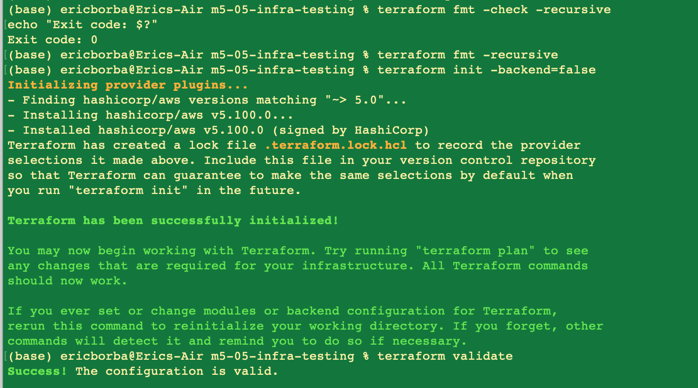
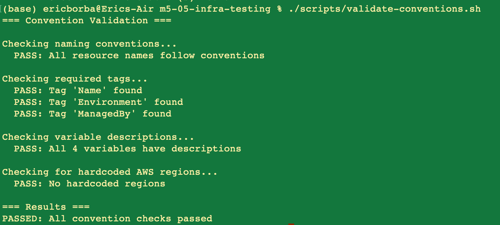
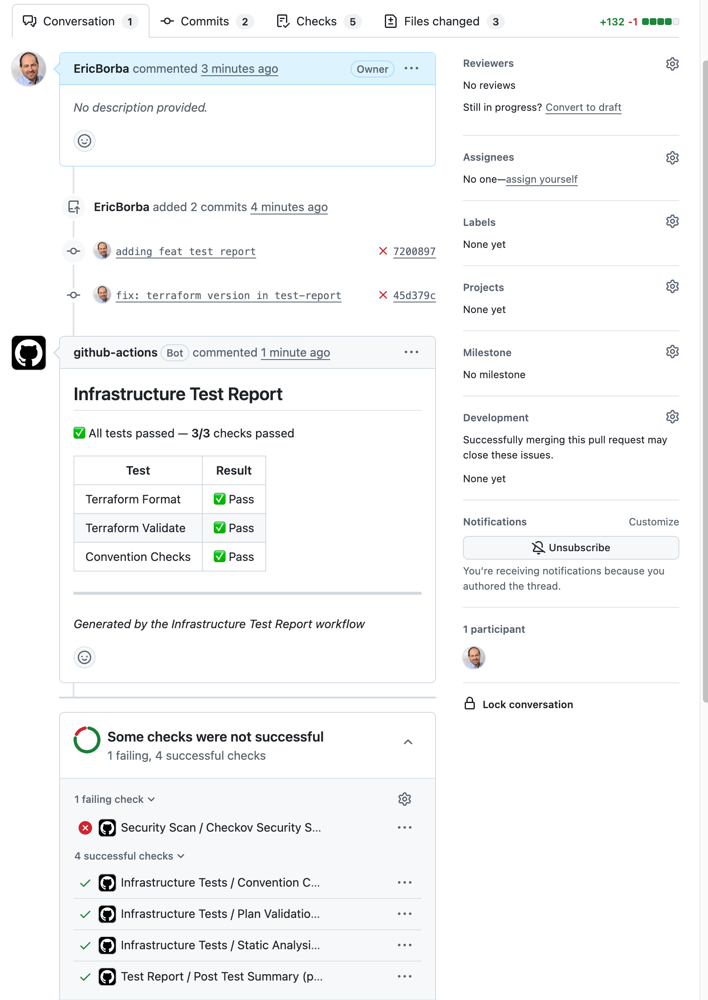
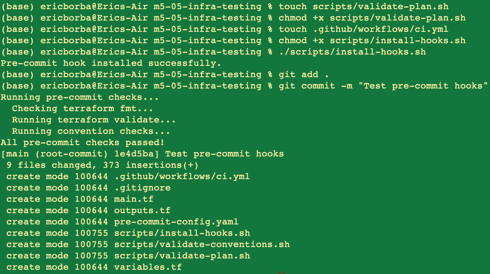

# Lab M5.05 - Infrastructure Testing & Validation

## Overview

This lab implements a multi-layer automated testing strategy for Terraform infrastructure code.
The setup catches issues at every stage — from the local editor to the CI pipeline — covering
an S3 bucket with versioning and KMS encryption, and a DynamoDB table for state locking..

---

## Infrastructure

| Resource | Type | Purpose |
|---|---|---|
| `aws_s3_bucket.data_store` | S3 Bucket | Primary data store with KMS encryption |
| `aws_s3_bucket_versioning.data_store` | S3 Versioning | Enables object versioning |
| `aws_s3_bucket_server_side_encryption_configuration.data_store` | S3 Encryption | Enforces KMS-based SSE |
| `aws_dynamodb_table.state_lock` | DynamoDB Table | Terraform state locking |

---

## Testing Layers

### Layer 1: Static Analysis

Runs built-in Terraform tooling to catch formatting and syntax issues early.

```bash
terraform fmt -check -recursive   # enforces consistent formatting
terraform init -backend=false      # initializes providers without a real backend
terraform validate                 # checks syntax and provider compatibility
```



### Layer 2: Convention Validation (`scripts/validate-conventions.sh`)

Custom bash script that enforces organization-specific standards:

- Resource names must be lowercase with underscores (`^[a-z][a-z0-9_]+$`)
- Required tags on all AWS resources: `Name`, `Environment`, `ManagedBy`
- All variables must have `description` fields
- No hardcoded AWS regions (must use `var.aws_region`)

```bash
./scripts/validate-conventions.sh
```



### Layer 3: Plan Validation (`scripts/validate-plan.sh`)

Parses `terraform plan` JSON output to verify the intended changes:

- Confirms all 4 expected resource types appear in the plan
- Warns on any unexpected resource destruction
- Uses `trap` to guarantee cleanup of plan artifacts on exit

```bash
./scripts/validate-plan.sh
```

> Requires valid AWS credentials since `terraform plan` contacts the AWS API.

### Layer 4: CI Pipeline (`.github/workflows/ci.yml`)

GitHub Actions workflow triggered on every PR and push to `main`:

```
static-analysis ──┬──> convention-checks
                  └──> plan-validation (depends on static-analysis)
```

- **static-analysis**: `terraform fmt`, `terraform init`, `terraform validate`, `tflint`
- **convention-checks**: runs `validate-conventions.sh`
- **plan-validation**: runs `validate-plan.sh` with AWS credentials from repository secrets

Merge is blocked if any job fails.

### Layer 5: Security Scanning (`.github/workflows/security-scan.yml`)

Runs [Checkov](https://www.checkov.io/) on every PR to detect security misconfigurations in the Terraform code:

- Scans for missing S3 public access blocks, unencrypted resources, overly permissive IAM policies, and more
- Skips `CKV_AWS_18` (S3 access logging) and `CKV_AWS_21` (S3 versioning) which are intentionally out of scope for this lab
- Uploads results as a SARIF artifact for review

> **Note:** The security scan failed on the test PR — this is the expected and correct outcome. Checkov identified real security gaps in the configuration (e.g. missing S3 public access block). The test worked as intended: it caught actual issues that should be remediated before merging.

### Layer 6: PR Test Report (`.github/workflows/test-report.yml`)

Posts an automated summary comment on every PR with a pass/fail table for each test layer, making the CI status immediately visible without having to open each job log.



### Layer 7: Pre-Commit Hooks (`scripts/install-hooks.sh`)

Installs a `.git/hooks/pre-commit` that runs all local checks before each commit:

```bash
./scripts/install-hooks.sh
```

The hook runs `terraform fmt`, `terraform validate`, and `validate-conventions.sh` automatically before every `git commit`.



---

## Repository Structure

```
m5-05-infra-testing/
├── main.tf                          # S3 bucket + DynamoDB table resources
├── variables.tf                     # Input variables with validation
├── outputs.tf                       # Output values
├── .pre-commit-config.yaml          # pre-commit framework config
├── scripts/
│   ├── validate-conventions.sh      # Custom naming/tagging/description checks
│   ├── validate-plan.sh             # Terraform plan output parsing
│   └── install-hooks.sh             # Git hook installer
└── .github/
    └── workflows/
        ├── ci.yml                   # Core CI pipeline (fmt, validate, tflint, conventions, plan)
        ├── security-scan.yml        # Checkov security scanning (Extra Mile)
        └── test-report.yml          # PR test summary comment bot (Extra Mile)
```

---

## How to Run Locally

```bash
# 1. Initialize Terraform
terraform init -backend=false

# 2. Static analysis
terraform fmt -check -recursive
terraform validate

# 3. Convention checks
./scripts/validate-conventions.sh

# 4. Plan validation (requires AWS credentials)
./scripts/validate-plan.sh

# 5. Install pre-commit hooks (one-time setup)
./scripts/install-hooks.sh
```

---

## Key Learnings

- **Multi-layer testing** catches different categories of issues: formatting, syntax, conventions, and intended changes
- **Static analysis is fast** and runs without AWS credentials — ideal as the first CI gate
- **Custom scripts** enforce organization standards that generic tools miss (required tags, naming conventions)
- **Plan parsing** validates actual changes before they reach real infrastructure
- **Pre-commit hooks** shift testing left, giving developers immediate feedback before code is even pushed
- **CI enforcement** ensures no untested code reaches the main branch
- **Security scanning failures are successes** — Checkov failing means it found real issues; a passing scan on deliberately insecure config would be the actual failure
- **PR test report bots** reduce friction by surfacing pass/fail status directly in the PR without requiring reviewers to dig into job logs
